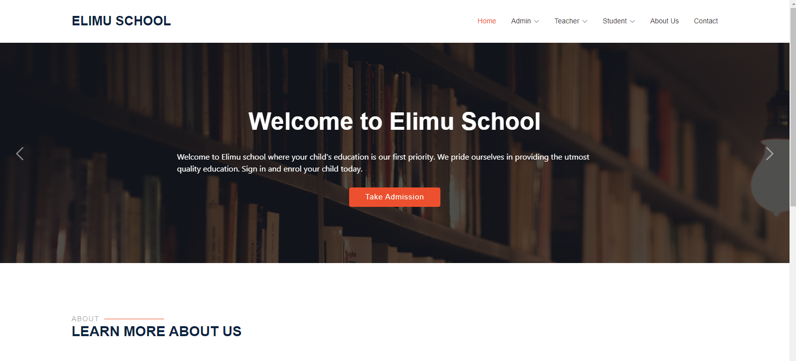

Homepage:

A simple school management system using Django and Bootstrap

Features:

1.Teacher:
A teacher can apply for a job and await approval by the admin. After approval, the teacher can log in and access the teacher dashboard to view attendances and any notices on the notice board. The teacher can also post announcements on the notice board.

2.Student:
A student can sign up and wait for approval from the admin. After approval by the admin, the student can access the student dashboard and view attendance details. Students can view announcements but cannot post them.

3.Admin:
Admin will signup for account then use the credentials to log in immediately as admin does not need approval after sign up. After logging in, they can acess the admin dashboard where they can see pending student and teacher addmissions and job applications respectively, where the admin can either aprove of delete/cancel the request. The admin can also add and update any student/teacher details, and make an announcement on the notice board.


How to run the project:
- Install Python
- Create a virtual environment
- Download This Project Zip Folder and Extract it inside the virtual environment
- Open Terminal and Execute Following Commands :

``` python -m pip install -r requirements.txt ```
- Move to project folder in Terminal. Then run following Commands :

```
py manage.py makemigrations
py manage.py migrate
py manage.py runserver
```
Open your browser and launch it on http://127.0.0.1:8000/


REQUIRED CHANGES FOR THE CONTACT US PAGE:
- In settings.py file, You have to give your email and password. Go to your email settings and generate the app password which you will use on the EMAIL_HOST_PASSWORD line.

```
EMAIL_HOST_USER = 'youremail@gmail.com'
EMAIL_HOST_PASSWORD = 'your email password'
EMAIL_RECEIVING_USER = 'youremail@gmail.com'
```

NAVIGATE TO THE 'SCREENSHOTS' FOLDER TO VIEW SCREENSHOTS OF THE PROJECT
